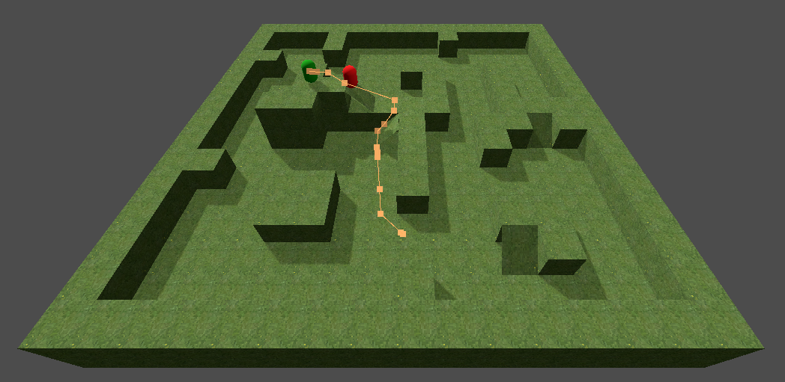

# godot_path_finding

Godot 4.4.1 3D path finding sample

> [!NOTE]
> By default target is positioned to expose an issue with agent to reach it

> [!NOTE]
> Target and Agent can be moved as you wish

> [!TIP]
> Right click to enable free camera